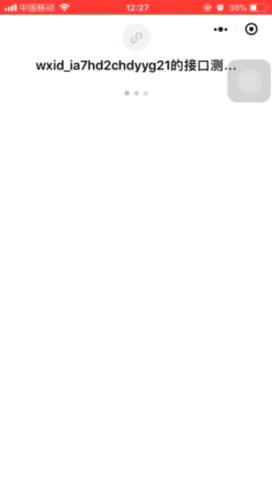

# <p align="center" >skeletons</p>
<div align="center">
<p>首屏渲染-小程序骨架屏动态注入组件</p>
</div>

<div style="text-align:center">
   
</div>

<br/>
<br/>

>skeletons组件中的默认值表格

<div>
    <table>
        <tr>
            <th>属性</th>
            <th>类型</th>
            <th>默认</th>
            <th>可选</th>
            <th>备注</th>
        </tr>
        <tr>
            <td>selector</td>
            <td>String</td>
            <td>'skeletons'</td>
            <td></td>
            <td>建议‘skeletons’写入容器class，默认wx.getSystemInfoSync()</td>
        </tr>
        <tr>
            <td>background</td>
            <td>String</td>
            <td>'#FFF'</td>
            <td></td>
            <td></td>
        </tr>
        <tr>
            <td>block_animation</td>
            <td>String</td>
            <td>'shine'</td>
            <td>'shine' || 'gradient'</td>
            <td></td>
        </tr>
        <tr>
            <td>loading</td>
            <td>String</td>
            <td>'music'</td>
            <td>'music' || 'shine'</td>
            <td></td>
        </tr>
        <tr>
            <td>is_captrue</td>
            <td>Boolean</td>
            <td>false</td>
            <td></td>
            <td>抓取节点控制</td>
        </tr>
        <tr>
            <td>is_complete</td>
            <td>Boolean</td>
            <td>false</td>
            <td></td>
            <td>渲染关闭控制</td>
        </tr>
    </table>
</div>

<br/>

|节点类|备注|
|-|-|
|skeletons-rect|正方形|
|skeletons-circle|圆形|
|skeletons-...|陆续开放|

<br/>


>列举案例的使用方法，老司机喵一眼就懂～

```html
    <!-- index.wxml include skeletons component -->
    
    <view class="container skeletons">
        <view class="author skeletons-circle">
            Titan_star
        </view>
        <view class="skeletons-rect">
            <text>
            首屏渲染-小程序骨架屏动态注入组件
            </text>
        </view>
        <view class="usermotto">
            <text class="user-motto skeletons-rect">Hello skeletons</text>
        </view>
    </view>

   <skeletons is_capture_nodes={{is_capture_nodes}} is_complete="{{is_complete}}" loading="music" block_animation="shine" selector="skeletons"
   background="#fff" />

```

```json
    /**
        index.wxml include skeletons file offset
    **/

    {
        "usingComponents":{
            "skeletons":"/components/skeletons/index"
        }
    }
```

```javascript
    /** index.js operating props value change **/

    wx.request({
        url:'/Titan_star',
        success:()=>{
            this.setData({
                is_capture_nodes:true //抓取节点绘制
            },()=>{

                /** 
                 *  绘制节点后，可能你会做些喜欢的事...
                 *  下面保留了另外的控制器，关闭骨架屏
                 *  让我们的代码，更加随心自由
                 *  **/

                this.setData({
                    is_complete:true
                })
            })
        }
    })
```

##contact


- 组件的功能还有许多的不足可以优化，也欢迎小伙伴有更好的建议issues提交


##License

[MIT](./LICENSE)

<a href="mailto:467158536@qq.com?subject=Hi Titan_star，给你提个建议">发送邮箱</a>

Copyright (c) 2018-present, Shiwen (Titan_star) Lai